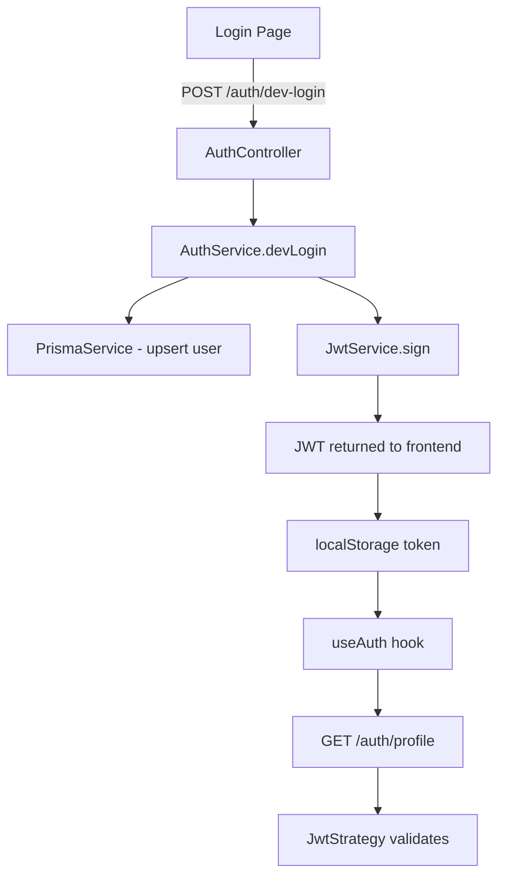

# Design Document: Disable Google Auth

## Overview

This design covers the changes needed to temporarily disable Google OAuth authentication from the Signova application while keeping the rest of the auth system functional. The approach is surgical: remove Google-specific code paths, replace the login UI with a simple email-based dev login, and preserve the JWT authentication flow end-to-end.

The replacement mechanism is a "Dev Login" — a minimal email-input form that calls a new backend endpoint. The endpoint upserts a user by email and returns a JWT, exactly as the Google OAuth flow did. This keeps `ProtectedRoute`, `useAuth`, and all JWT-guarded API routes working without modification.

Google OAuth code that may need to be re-enabled later will be commented out with `// TODO: Re-enable Google OAuth` markers rather than deleted.

---

## Architecture

The change touches three layers:



**What changes:**
- `AuthController`: remove `googleAuth` and `googleAuthRedirect` handlers; add `devLogin` endpoint
- `AuthService`: add `devLogin(email)` method; keep `validateOAuthUser` commented out
- `AuthModule`: remove `GoogleStrategy` from providers; keep all JWT wiring
- `google.strategy.ts`: comment out entire file contents
- `Login.tsx`: replace Google button with email form
- `AuthCallback.tsx`: redirect immediately to `/login` instead of processing token

**What stays the same:**
- `JwtStrategy` — untouched
- `useAuth` hook — untouched
- `ProtectedRoute` — untouched
- `GET /auth/profile` — untouched
- All other modules (signatures, teams) — untouched

---

## Components and Interfaces

### Backend: New `devLogin` endpoint

```
POST /auth/dev-login
Body: { email: string }
Response 200: { access_token: string, user: { id, email, name, avatarUrl } }
Response 400: { message: "Invalid email" }
```

The endpoint is unguarded (no `AuthGuard`) since it is the login mechanism itself.

### Backend: `AuthService.devLogin`

```typescript
async devLogin(email: string): Promise<{ access_token: string; user: object }>
```

Upserts a user by email (create if not exists, find if exists), signs a JWT, returns the same shape as the old `validateOAuthUser`.

### Backend: `AuthController` changes

- `@Get('google')` and `@Get('google/callback')` handlers removed (routes will 404 naturally)
- New `@Post('dev-login')` handler added

### Frontend: `Login.tsx`

Replaces the Google button with a controlled email input + submit button. On submit, calls `POST /api/v1/auth/dev-login`, then calls `login(access_token)` from `useAuth`.

### Frontend: `AuthCallback.tsx`

Simplified to immediately call `navigate('/login')` on mount, with no token processing.

---

## Data Models

No schema changes required. The existing `User` model handles dev login:

```prisma
model User {
  id        String  @id @default(uuid())
  email     String  @unique
  name      String
  provider  String  // will be set to "dev" for dev-login users
  ...
}
```

For dev login users, `name` defaults to the email address prefix (part before `@`) and `provider` is set to `"dev"`.

### Dev Login DTO

```typescript
// apps/api/src/auth/dto/dev-login.dto.ts
export class DevLoginDto {
  email: string; // validated with IsEmail() from class-validator
}
```

---

## Correctness Properties

*A property is a characteristic or behavior that should hold true across all valid executions of a system — essentially, a formal statement about what the system should do. Properties serve as the bridge between human-readable specifications and machine-verifiable correctness guarantees.*

### Property 1: Dev login with valid email upserts user and issues JWT

*For any* valid email address submitted to the dev login endpoint, the system SHALL create or retrieve exactly one user record with that email in the database AND return a valid JWT that, when decoded, contains that email as the `email` claim.

**Validates: Requirements 5.2, 5.4**

### Property 2: Invalid email is rejected without side effects

*For any* string that is not a valid email address (empty string, whitespace-only, missing `@`, malformed), submitting it to the dev login endpoint SHALL return a 400 error response and SHALL NOT create any new user record in the database.

**Validates: Requirements 5.3**

### Property 3: JWT validation gates protected routes

*For any* valid JWT issued by the system, a request to `GET /auth/profile` with that token in the `Authorization: Bearer` header SHALL return HTTP 200 with the user's profile. *For any* token that is expired, malformed, or signed with a different secret, the same request SHALL return HTTP 401.

**Validates: Requirements 6.1, 6.3**

---

## Error Handling

| Scenario | Behavior |
|---|---|
| `POST /auth/dev-login` with empty body | 400 Bad Request — "email must be a valid email" |
| `POST /auth/dev-login` with malformed email | 400 Bad Request — "email must be a valid email" |
| `GET /auth/google` (disabled route) | 404 Not Found (route simply does not exist) |
| `GET /auth/google/callback` (disabled route) | 404 Not Found |
| `GET /auth/profile` with expired JWT | 401 Unauthorized |
| `GET /auth/profile` with no token | 401 Unauthorized |
| Dev login DB failure | 500 Internal Server Error (propagated from Prisma) |
| Frontend: dev login API call fails | Error message displayed inline in the login form |
| Frontend: `/auth-callback` visited | Immediate redirect to `/login` |

---

## Testing Strategy

### Unit Tests

Focus on specific examples and edge cases:

- `AuthService.devLogin`: new email creates user with `provider: "dev"`, existing email retrieves user, returned JWT decodes to correct email
- `AuthController`: `POST /auth/dev-login` with valid email returns 200 + token; with invalid email returns 400
- `Login.tsx`: renders email input and submit button; does NOT render Google button; shows error on empty submit
- `AuthCallback.tsx`: navigates to `/login` on mount; does NOT call `login()` even when `?token=` query param is present

### Property-Based Tests

Using [fast-check](https://github.com/dubzzz/fast-check) for TypeScript.

Each property test runs a minimum of 100 iterations.

**Property 1: Dev login with valid email upserts user and issues JWT**
- Generator: `fc.emailAddress()` — produces arbitrary valid email strings
- For each email: call `authService.devLogin(email)`, assert `access_token` is a non-empty string, decode JWT and assert `email` claim matches input, query DB and assert exactly one user with that email exists
- Tag: `Feature: disable-google-auth, Property 1: dev login with valid email upserts user and issues JWT`

**Property 2: Invalid email is rejected without side effects**
- Generator: `fc.string()` filtered to exclude valid emails (empty strings, whitespace, strings without `@`, etc.)
- For each invalid string: call the endpoint and assert HTTP 400 is returned, assert no new user was created
- Tag: `Feature: disable-google-auth, Property 2: invalid email is rejected without side effects`

**Property 3: JWT validation gates protected routes**
- Generator for valid tokens: `fc.record({ email: fc.emailAddress(), sub: fc.uuid() })` — generate payloads, sign with the real JWT secret
- Generator for invalid tokens: `fc.string()` (random strings), plus tokens signed with a wrong secret
- For valid tokens: assert `GET /auth/profile` returns 200
- For invalid tokens: assert `GET /auth/profile` returns 401
- Tag: `Feature: disable-google-auth, Property 3: JWT validation gates protected routes`

### Integration Tests

- App starts successfully with no `GOOGLE_CLIENT_ID`, `GOOGLE_CLIENT_SECRET`, or `GOOGLE_CALLBACK_URL` env vars set
- `GET /auth/google` returns 404
- `GET /auth/google/callback` returns 404
- Full dev login flow: POST email → receive JWT → GET /auth/profile with JWT → receive user profile
